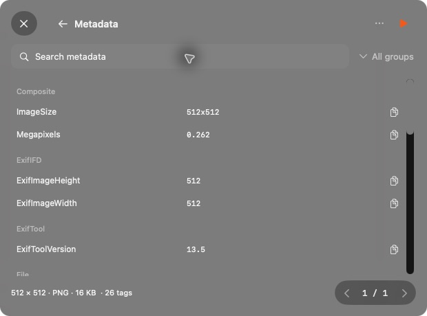
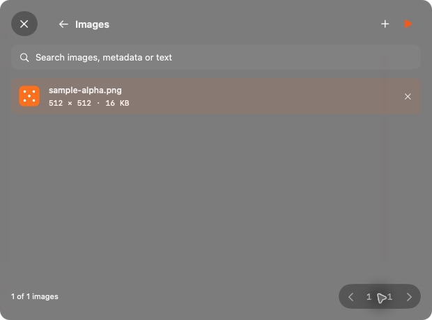
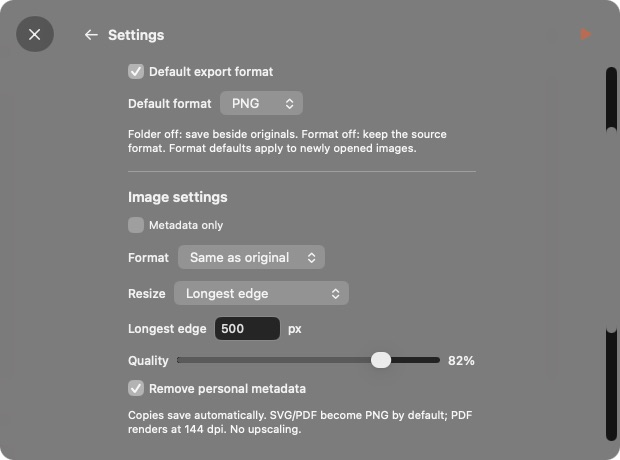

# Dice

## Install

macOS 14+ · Apple silicon

1. [Download Dice](https://github.com/lumen-xx/dice-releases/releases), unzip and move **Dice.app** to **Applications**.
2. Open Dice. If blocked, go to **System Settings → Privacy & Security → Open Anyway**, or run:

```sh
xattr -dr com.apple.quarantine /Applications/Dice.app
```

Use this only for Dice downloaded here. This preview is not yet notarized.

A small native Mac app to convert, resize and compress images, inspect metadata and remove personal tags. Everything happens locally on your Mac. Originals stay untouched.


- Convert to JPEG, PNG, HEIC, WebP, GIF, BMP, TIFF or native AVIF. SVG/PDF become images; PDF pages, GIF frames and TIFF pages appear separately. Camera RAW uses available macOS decoders.
- Resize by longest edge, percentage or a bounding box. **Resize all** changes resolution only and skips smaller images.
- Compress lossy images with a quality slider; export lossless WebP.
- Remove personal metadata, including a metadata-only mode that keeps pixels unchanged.
- Browse complete textual ExifTool metadata, search/filter tags and copy individual values or export JSON.
- Search batches by filename, metadata, dimensions or recognized image text.



## Using Dice

Requires **macOS 14 or newer and an Apple-silicon Mac**. The app is about **31.6 MB installed / 10.1 MB downloaded**. ExifTool, WebP and SVG rendering tools are bundled.

Drop images into Dice, use **+**, or choose **Open With → Dice** in Finder. Press **⌘,** or the sliders for Settings inside Dice. Choose your settings and press **Start** to process and save copies in one step. Enable a default export folder and/or format independently; otherwise copies save beside originals using the source format.

The page number opens the searchable image list. Removing an image from Dice leaves its original file in place. Copies save automatically. If saving fails, use **Dice → Save Copies As…** before closing.





## Updates

Use **Dice → Check for Updates…** to get later versions directly from GitHub. Updates and the update feed are signed. Preview releases are enabled by default; turn off **Include Preview Releases** to follow stable releases only. Enable **Automatically check for updates** in Settings if wanted; it is off by default. No GitHub account is required.

Use the in-app updater after the first approval. Downloading another ZIP through a browser can trigger macOS approval again. Update signatures do not replace Apple notarization.

## Preview limits

PNG re-encoding can increase file size. GIF frames, TIFF pages and PDF pages export as separate still images; animation export is not preserved. Other multi-image formats are rejected. JPEG flattens transparency onto white; HDR conversion is not preserved as HDR. Metadata removal does not anonymize filenames or file-system attributes. Intel builds and clean-machine compatibility testing are still pending.

This repository contains compiled downloads, screenshots, release notes and the signed update feed. The Dice source repository is private.
